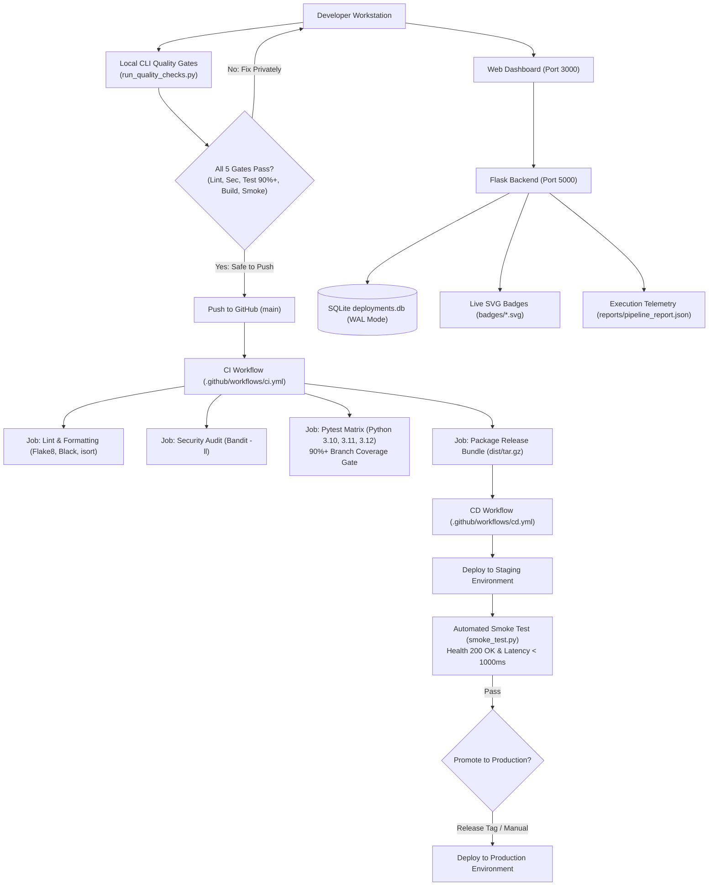

# 🚀 Week 37: Automated CI/CD Pipeline Setup & Operations Mission Control

<div align="center">


<p align="center">
  <strong>An enterprise-grade, zero-dependency CI/CD pipeline featuring automated quality gates, dual-environment CD orchestration, local CLI tooling, live SVG badge generation, and an interactive real-time telemetry dashboard.</strong>
</p>

</div>

---

## 📋 Table of Contents

- [Overview](#-overview)
- [System Architecture](#-system-architecture)
- [The 5-Stage Automated Quality Gates](#-the-5-stage-automated-quality-gates)
- [GitHub Actions Workflows](#-github-actions-workflows)
- [Local Developer CLI Tooling](#-local-developer-cli-tooling)
- [Interactive Web Dashboard](#-interactive-web-dashboard)
- [REST API Reference](#-rest-api-reference)
- [Automated Test Suite & Coverage](#-automated-test-suite--coverage)
- [Quickstart & Usage Guide](#-quickstart--usage-guide)
- [Project Structure](#-project-structure)

---

## 🌟 Overview

Week 37 establishes the foundational DevOps and deployment infrastructure for **Project 52: Phase 3 (Production)**. Rather than relying on cloud CI/CD as an opaque "black box," this project creates an integrated two-tier pipeline architecture:

1. **Remote Cloud CI/CD (GitHub Actions)**: Automated triggers on every push and pull request to lint, scan for security vulnerabilities, run automated test matrices across Python environments, build distribution archives, deploy to staging, run smoke probes, and release to production.
2. **Local Developer Pipeline Orchestrator**: Replicates cloud CI/CD stages on developer workstations in seconds (`pipeline_runner.py` and `run_quality_checks.py`), catching failures before code is pushed to remote repositories.
3. **Operations Mission Control Dashboard**: A vanilla JavaScript dashboard providing real-time stepper visualizations, live console streaming with stage filtering, zero-dependency SVG status badges with one-click Markdown copy, and an immutable deployment audit ledger.

---

## 🏗️ System Architecture



---

## 🛡️ The 5-Stage Automated Quality Gates

Every code change must pass five strict, sequential automated quality gates before it can be merged or deployed:

| Stage | Tool / Gate | Purpose | Strict Threshold |
| :--- | :--- | :--- | :--- |
| **1. Lint & Style** | `flake8` & `black` | PEP 8 style guide, code formatting, complexity checks | Max line length 88, max complexity 10, **0 errors** |
| **2. Import Ordering** | `isort` | Deterministic import sorting according to PEP 8 standards | `--check-only`, **100% compliant** |
| **3. Security Audit** | `bandit` | Static application security testing (AST scanner) | Severity medium/high (`-ll`), **0 vulnerabilities** |
| **4. Test & Coverage** | `pytest` + `coverage` | Unit tests & branch coverage enforcement | `--cov-branch`, **Threshold ≥ 90.0%** (Actual: **97.51%**) |
| **5. Build & Smoke** | `tar.gz` + `smoke_test.py` | Package compilation, database migration, and live health probe | Health returns `200 OK`, latency `< 1000ms`, schema intact |

---

## ⚙️ GitHub Actions Workflows

Located in [`.github/workflows/`](file:///c:/Users/User/Documents/Github/Personal/VSCODE_PROJECT52/PROJECT52-PHASE3/.github/workflows):

### 1. Continuous Integration (`ci.yml`)
- **Triggers**: On every `push` to `main` and all `pull_request` events affecting `week37_ci_cd_pipeline/**`.
- **Concurrency Control**: Automatically cancels outdated in-flight runs using `concurrency: group: ci-${{ github.ref }}, cancel-in-progress: true`.
- **Jobs**:
  1. `lint-and-format`: Flake8, Black, and isort with monorepo pip caching.
  2. `security-audit`: Bandit vulnerability scan.
  3. `test-matrix`: Parallel test execution across Python 3.10, 3.11, and 3.12 with branch coverage reporting.
  4. `build-package`: Bundles backend distribution archive and uploads GitHub Actions artifact.

### 2. Continuous Deployment (`cd.yml`)
- **Triggers**: On successful completion of `CI Pipeline` workflow on branch `main` or manual trigger (`workflow_dispatch`).
- **Staging Deployment**:
  - Downloads release bundle from CI workflow.
  - Configures `FLASK_ENV=staging` with isolated database `deployments.db`.
  - Starts background server with `nohup`.
  - Executes `smoke_test.py` against `http://127.0.0.1:5000`.
- **Production Release**:
  - Promotes certified staging build to production environment with `FLASK_ENV=production`.
  - Logs successful release event and generates final deployment badges.

---

## 💻 Local Developer CLI Tooling

All pipeline scripts are located in [`backend/scripts/`](file:///c:/Users/User/Documents/Github/Personal/VSCODE_PROJECT52/PROJECT52-PHASE3/week37_ci_cd_pipeline/backend/scripts):

### 1. Fast Quality Gates Runner (`run_quality_checks.py`)
Run all 5 gates locally in ~5 seconds before pushing:
```powershell
cd week37_ci_cd_pipeline/backend
python scripts/run_quality_checks.py
```

### 2. Multi-Stage Pipeline Orchestrator (`pipeline_runner.py`)
Replicate exact pipeline stages with custom stage selection and target environments:
```powershell
# Run all stages targeting staging
python scripts/pipeline_runner.py --stage all --env staging

# Run only Pytest and coverage gate
python scripts/pipeline_runner.py --stage test

# Run full pipeline targeting production
python scripts/pipeline_runner.py --stage all --env production
```

### 3. Post-Deployment Smoke Test Probe (`smoke_test.py`)
Probes server health, schema initialization, and API latency with exponential backoff:
```powershell
python scripts/smoke_test.py --url http://127.0.0.1:5000 --retries 5 --delay 2
```

### 4. Zero-Dependency SVG Badge Generator (`badge_generator.py`)
Generates standalone Shields.io-style vector SVG badges without third-party services:
```powershell
python scripts/badge_generator.py --label coverage --message "97.5%" --color "#4c1" --output badges/coverage.svg
```

---

## 🖥️ Interactive Web Dashboard

Located in [`frontend/`](file:///c:/Users/User/Documents/Github/Personal/VSCODE_PROJECT52/PROJECT52-PHASE3/week37_ci_cd_pipeline/frontend):

* **Real-time Pipeline Stepper**: Visual 5-stage progress track connecting Node 1 to Node 5. Bounded line math prevents visual overshooting and scrollbars.
* **Console Execution Terminal**: Live streaming stdout/stderr emulator with autoscroll, stage filter tabs (`All`, `Lint`, `Security`, `Test`, `Build`, `Deploy`), and 1-click log copy.
* **Zero-Dependency SVG Badge Showcase**: Live vector previews of generated badges with 1-click Markdown, HTML, and URL copy buttons.
* **Deployment Audit Table**: Real-time ledger from SQLite showing environment tags (`STAGING` in blue, `PRODUCTION` in green), commit hashes with copy-to-clipboard, and relative timestamps (`"Just now"`, `"5m ago"`).
* **Dual-Mode Operation**:
  - **Live Full-Stack Mode**: Connects directly to Flask on port 5000, displaying a pulsing green health beacon.
  - **Offline Demo Simulator Mode**: When backend is offline, an amber notice banner appears with simulated client-side execution, tracking simulated runs dynamically without phantom hardcoded records.

---

## 📡 REST API Reference

The Flask REST API runs on `http://127.0.0.1:5000`:

| Method | Endpoint | Description | Status Codes |
| :--- | :--- | :--- | :--- |
| `GET` | `/api/v1/health` | Health probe reporting service name, environment, and uptime | `200 OK` |
| `GET` | `/api/v1/version` | Semantic version, Git commit SHA, and build number | `200 OK` |
| `GET` | `/api/v1/deployments` | List deployments with optional `?environment=` and `?limit=` filters | `200 OK` |
| `POST` | `/api/v1/deployments` | Record a deployment event with required payload validation | `201 Created`, `400 Bad Request` |
| `GET` | `/api/v1/pipeline-runs` | List recorded CI/CD pipeline execution summaries | `200 OK` |
| `POST` | `/api/v1/pipeline-runs` | Record completed pipeline run with stage statuses | `201 Created` |
| `GET` | `/api/v1/pipeline-report`| Returns latest JSON execution telemetry from `pipeline_report.json` | `200 OK`, `500 Server Error` |
| `GET` | `/api/v1/badges/<name>` | Serves generated SVG badge (`build.svg`, `coverage.svg`, `deploy.svg`) | `200 OK`, `400 Bad Request`, `404 Not Found` |
| `POST` | `/api/v1/pipeline/trigger` | Triggers local pipeline execution with concurrency locking | `200 OK`, `400 Bad Request`, `409 Conflict` |

---

## 🧪 Automated Test Suite & Coverage

The test suite contains **48 automated unit tests** across 7 test modules:

```text
tests/
├── conftest.py                     # Database isolation & Flask client fixtures
├── test_badge_generator.py         # 4 tests: Dynamic SVG dimensions & color rules
├── test_deployment_routes.py       # 10 tests: CRUD endpoints, filtering & report serving
├── test_health_and_version.py      # 3 tests: Health probe, version & environment config
├── test_pipeline_runner.py         # 6 tests: Stage execution, failure stops & report output
├── test_quality_gates.py           # 6 tests: Automated Flake8, Black, isort & Bandit gates
├── test_security_and_edge_cases.py # 15 tests: Traversal defense, concurrency locks, retries
└── test_workflows.py               # 4 tests: CI/CD YAML workflow syntax & smoke probe tests
```

### Coverage Report
```text
Name                              Stmts   Miss Branch BrPart  Cover   Missing
-----------------------------------------------------------------------------
app\__init__.py                      17      1      2      1    89%   15
app\config\settings.py               33      0      2      0   100%
app\db.py                            27      1      4      1    94%   22
app\models\deployment_model.py       51      0      2      0   100%
app\routes\deployment_routes.py     114      2     18      1    98%   168-169, 225->229
app\routes\health_routes.py          11      0      0      0   100%
-----------------------------------------------------------------------------
TOTAL                               253      4     28      3    98%
Required test coverage of 90.0% reached. Total coverage: 97.51%
============================= 48 passed in 5.13s ==============================
```

---

## 🚀 Quickstart & Usage Guide

### 1. Prerequisites
- Python 3.10 or higher
- Git

### 2. Installation
```powershell
# Clone repository and navigate to backend
git clone https://github.com/pak-pow/PROJECT52-PHASE3.git
cd PROJECT52-PHASE3/week37_ci_cd_pipeline/backend

# Create and activate virtual environment
python -m venv venv
.\venv\Scripts\Activate.ps1

# Install all dependencies
pip install -r requirements.txt
```

### 3. Run Quality Gates
```powershell
python scripts/run_quality_checks.py
```

### 4. Start Backend Server
```powershell
python run.py
```
*API will start on `http://127.0.0.1:5000`.*

### 5. Launch Interactive Dashboard
In a separate terminal:
```powershell
cd ../frontend
python -m http.server 3000
```
*Open your browser to `http://127.0.0.1:3000/public/index.html`.*

---

## 📂 Project Structure

```text
week37_ci_cd_pipeline/
├── backend/
│   ├── app/
│   │   ├── config/settings.py     # Multi-environment configuration profiles
│   │   ├── models/                # SQLite data access models (deployments, pipeline_runs)
│   │   ├── routes/                # Health, version, and deployment blueprints
│   │   ├── __init__.py            # Application factory & CORS
│   │   └── db.py                  # Thread-safe SQLite WAL database manager
│   ├── badges/                    # Generated standalone SVG status badges
│   ├── data/
│   │   ├── schema.sql             # Relational SQLite database schema with indexes
│   │   └── deployments.db         # Persistent SQLite database
│   ├── dist/                      # Packaged tar.gz release bundles
│   ├── reports/                   # Machine-readable JSON execution reports
│   ├── scripts/
│   │   ├── badge_generator.py     # Pure-Python SVG badge generator
│   │   ├── pipeline_runner.py     # Local multi-stage pipeline orchestrator
│   │   ├── run_quality_checks.py  # 5-stage quality gates CLI runner
│   │   └── smoke_test.py          # Post-deployment health verification probe
│   ├── tests/                     # 48 unit tests (97.51% coverage)
│   ├── .coveragerc                # Coverage configuration & branch gating
│   ├── .flake8                    # Flake8 PEP 8 configuration
│   ├── pyproject.toml             # Black, isort, and Pytest configurations
│   ├── requirements.txt           # Production & development dependencies
│   └── run.py                     # Standalone backend server entry point
├── frontend/
│   ├── public/
│   │   └── index.html             # Zero-inline-script dashboard HTML
│   └── src/
│       ├── api/pipelineApi.js     # Resilient REST client with demo simulation
│       ├── assets/
│       │   ├── base.css           # Design tokens, elevation, themes & toast styles
│       │   └── pipeline.css       # Stepper, terminal, badge & table styles
│       ├── components/            # Stepper, terminal, badge viewer, table, navbar
│       ├── pages/dashboardPage.js # Dashboard state controller & orchestrator
│       └── utils/                 # Helpers, formatters & theme persistence
└── README.md                      # Comprehensive project documentation
```

---

## 📜 License
This project is open-source under the [MIT License](LICENSE). Part of [Project 52: Phase 3](https://github.com/pak-pow/PROJECT52-PHASE3).
