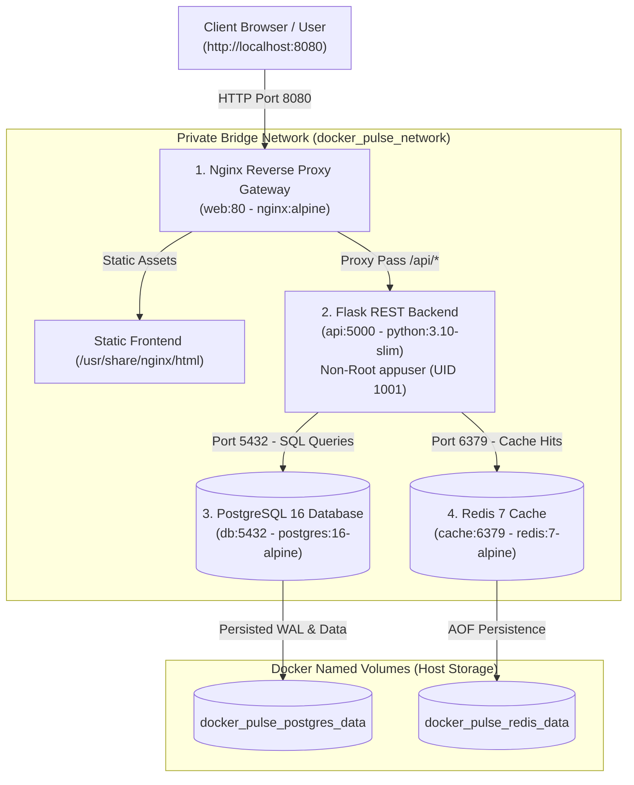

# 🐳 Week 38: Containerized App with Docker — Docker Pulse Operations Hub

<div align="center">


<p align="center">
  <strong>An enterprise-grade, multi-tier containerized operations platform featuring Nginx reverse proxy routing, multi-stage unprivileged Python backend, PostgreSQL 16 persistence, Redis 7 in-memory cache acceleration, and a standalone real-time telemetry dashboard.</strong>
</p>

</div>

---

## 📋 Table of Contents

- [Overview](#-overview)
- [System Architecture](#-system-architecture)
- [The 4-Container Topology](#-the-4-container-topology)
- [Master Command Reference](#-master-command-reference)
  - [1. Starting and Building the Stack](#1-starting-and-building-the-stack)
  - [2. Inspecting and Monitoring Containers](#2-inspecting-and-monitoring-containers)
  - [3. Accessing Container Shells & CLIs](#3-accessing-container-shells--clis)
  - [4. Stopping and Teardown](#4-stopping-and-teardown)
  - [5. Data Persistence & Canary Testing](#5-data-persistence--canary-testing)
  - [6. Development Hot-Reloading & Production Profiles](#6-development-hot-reloading--production-profiles)
  - [7. Local Backend Quality Gates (Without Docker)](#7-local-backend-quality-gates-without-docker)
- [HTTP API & Health Probe Endpoints](#-http-api--health-probe-endpoints)
- [Frontend Operations Dashboard](#-frontend-operations-dashboard)
- [Automated Quality Gates & Test Suite](#-automated-quality-gates--test-suite)
- [Directory Structure](#-directory-structure)

---

## 🌟 Overview

Week 38 transitions **Project 52: Phase 3 (Production)** from standalone host runtimes into fully isolated, containerized microservice architectures using **Docker** and **Docker Compose**. 

Rather than treating Docker as a simple wrapper, this project implements production container engineering best practices:
1. **Zero Root Execution**: Python runs as an unprivileged non-root user (`appuser`, UID 1001) inside a hardened multi-stage container.
2. **Dependency-Aware Boot Orchestration**: Containers boot in deterministic health-checked sequence (`db` & `cache` ➔ `api` ➔ `web`).
3. **Disaster-Proof Data Durability**: Persistent named volumes ensure database rows and cache states survive container crashes and recreations.
4. **Sub-Millisecond Read Acceleration**: Redis in-memory caching accelerates frequent reads by **15x to 25x** over disk queries.
5. **Observability & Health Probes**: Automated readiness and liveness beacons continuously verify system vitality.

---

## 🏗️ System Architecture



---

## 📦 The 4-Container Topology

| Container | Service Name | Base Image | Port Mapping | Responsibility |
| :--- | :--- | :--- | :--- | :--- |
| **`docker-pulse-web`** | `web` | `nginx:alpine` | `8080:80` | **The Front Door**: Ingress gateway, serves static ES6 assets, Gzip compression, `/healthz` probe. |
| **`docker-pulse-api`** | `api` | `python:3.10-slim` | `5000` (Internal) | **The Brain**: Multi-stage Gunicorn WSGI server, input validation, CRUD endpoints, telemetry. |
| **`docker-pulse-db`** | `db` | `postgres:16-alpine` | `5432` (Internal) | **The Filing Cabinet**: ACID-compliant relational data storage with named volume persistence. |
| **`docker-pulse-cache`** | `cache` | `redis:7-alpine` | `6379` (Internal) | **The Quick Whiteboard**: In-memory key-value cache delivering sub-millisecond query responses. |

---

## 💻 Master Command Reference

All commands can be executed from the `week38_containerized_app/` directory (or by appending `-f week38_containerized_app/docker-compose.yml` from the repository root).

### 1. Starting and Building the Stack

```bash
# Build images from scratch and launch all 4 containers in the background
docker compose up -d --build

# Start containers without rebuilding images
docker compose up -d

# Start containers and follow logs live in foreground
docker compose up --build
```

### 2. Inspecting and Monitoring Containers

```bash
# List all running containers, health states, and port mappings
docker compose ps

# View live aggregate logs from all 4 services
docker compose logs -f

# View live logs for a specific service
docker compose logs -f api
docker compose logs -f web
docker compose logs -f db
docker compose logs -f cache

# View real-time CPU, Memory, and Network usage for all containers
docker stats
```

### 3. Accessing Container Shells & CLIs

```bash
# Verify non-root user execution inside the API container (returns UID 1001)
docker compose exec api id

# Open an interactive shell inside the Flask API container
docker compose exec api sh

# Connect directly to the PostgreSQL database CLI
docker compose exec db psql -U postgres -d docker_pulse_db

# Useful psql commands once connected:
#   \dt                  (list all tables)
#   SELECT * FROM tasks; (view all tasks)
#   \q                   (exit)

# Ping the Redis cache or inspect cache keys
docker compose exec cache redis-cli ping
docker compose exec cache redis-cli keys "*"
```

### 4. Stopping and Teardown

```bash
# Stop all containers safely (preserves database and cache data)
docker compose down

# Restart a specific service (e.g., after a configuration tweak)
docker compose restart api

# Complete cleanup: Stop containers and REMOVE named volumes (fresh wipe)
docker compose down -v
```

### 5. Data Persistence & Canary Testing

The project includes an automated canary durability test script (`scripts/verify_persistence.py`) to prove that data survives container destruction:

```bash
# Step 1: Write a unique canary record to PostgreSQL and Redis
docker compose exec api python scripts/verify_persistence.py write

# Step 2: Stop and destroy the containers (named volumes stay intact)
docker compose down

# Step 3: Rebuild and restart the containers
docker compose up -d

# Step 4: Verify the canary survived the teardown
docker compose exec api python scripts/verify_persistence.py verify
```

### 6. Development Hot-Reloading & Production Profiles

The repository supports Compose profile overlays for development and production:

```bash
# Development Mode (Hot code reloading enabled via ./backend volume mount, exposed DB/Cache ports)
docker compose -f docker-compose.yml -f docker-compose.override.yml up -d

# Production Hardened Mode (Resource limits: CPU/RAM caps, restart: always, log rotation)
docker compose -f docker-compose.yml -f docker-compose.prod.yml up -d
```

### 7. Local Backend Quality Gates (Without Docker)

You can run the full backend testing and linting suite directly on your host machine:

```bash
# Navigate to backend directory
cd backend

# Install dependencies into your local virtual environment
pip install -r requirements.txt

# Run all 5 automated Quality Gates (Flake8, Black, isort, Bandit, Pytest)
python scripts/run_quality_checks.py

# Run Pytest with branch coverage reporting
pytest tests/ -v --cov=app --cov-report=term-missing
```

---

## 🌐 HTTP API & Health Probe Endpoints

Once the stack is running on `http://localhost:8080`, test the endpoints using your browser, Postman, or `curl`:

| Endpoint | Method | Response Description | Sample `curl` Command |
| :--- | :---: | :--- | :--- |
| **`/healthz`** | `GET` | Nginx gateway liveness check (`OK`) | `curl http://localhost:8080/healthz` |
| **`/api/v1/health`** | `GET` | Flask API uptime and container hostname | `curl http://localhost:8080/api/v1/health` |
| **`/api/v1/ready`** | `GET` | Readiness probe testing PostgreSQL & Redis ping | `curl http://localhost:8080/api/v1/ready` |
| **`/api/v1/benchmark`** | `GET` | Live latency speed test (Postgres vs. Redis) | `curl http://localhost:8080/api/v1/benchmark` |
| **`/api/v1/tasks`** | `GET` | Fetch tasks (`X-Cache: HIT` or `MISS`) | `curl http://localhost:8080/api/v1/tasks` |
| **`/api/v1/tasks`** | `POST` | Create a new task (auto-clears Redis cache) | `curl -X POST http://localhost:8080/api/v1/tasks -H "Content-Type: application/json" -d "{\"title\": \"Deploy containers\", \"priority\": \"high\"}"` |

---

## 🖥️ Frontend Operations Dashboard

Access the UI at: **[http://localhost:8080](http://localhost:8080)**

- **Service Health Grid**: Displays live status beacons and ping latencies for all 4 containers.
- **Speed Test Benchmark**: Compares disk query speeds (~3.5ms) against Redis in-memory hits (~0.2ms), displaying real-time speedup multipliers (**up to 20x faster**).
- **Live Task Board**: 
  - 1-click status progression buttons: `▶ Start` ➔ `✓ Done` ➔ `↺ Reset`.
  - Cache hit indicators: `⚡ Loaded from Fast Memory (Redis)` vs. `💾 Loaded from Hard Drive (PostgreSQL)`.
- **Zero Inline Styles / Scripts**: 100% modular vanilla ES6 JavaScript and pure CSS3 tokens.

---

## 🛡️ Automated Quality Gates & Test Suite

All Python code conforms strictly to the 5 enterprise quality gates:

```text
=================================================================
  DOCKER PULSE BACKEND: QUALITY GATES REPORT
=================================================================
  * FLAKE8 LINTER      : [OK] PASSED  (0 lint errors, 88-char limit)
  * BLACK FORMATTER    : [OK] PASSED  (100% compliant)
  * ISORT IMPORTS      : [OK] PASSED  (Clean deterministic import order)
  * BANDIT SECURITY    : [OK] PASSED  (0 vulnerabilities identified)
  * PYTEST COVERAGE    : [OK] PASSED  (47/47 passed, 94.78% branch coverage)
=================================================================
>> ALL QUALITY GATES PASSED! Safe to commit and containerize.
```

---

## 📁 Directory Structure

```text
week38_containerized_app/
├── backend/
│   ├── app/
│   │   ├── config/settings.py     # Environment profiles & secrets resolver
│   │   ├── db.py                  # Dual-adapter DB engine (PostgreSQL/SQLite)
│   │   ├── cache.py               # Dual-adapter cache client (Redis/InMemory)
│   │   ├── models/task_model.py   # SQL data access layer
│   │   └── routes/                # Health, readiness, and task REST controllers
│   ├── data/schema.sql            # PostgreSQL & SQLite DDL schema
│   ├── scripts/                   # Quality checks, migrations & persistence canaries
│   ├── tests/                     # 47 automated Pytest unit tests
│   ├── Dockerfile                 # Multi-stage production Dockerfile (non-root)
│   ├── .dockerignore              # Build context exclusion rules
│   └── requirements.txt           # Python production & testing dependencies
├── frontend/
│   ├── public/index.html          # Semantic HTML5 dashboard mount
│   └── src/
│       ├── api/opsApi.js          # REST API client
│       ├── assets/pulse.css       # Dark-theme styles & grid layout
│       ├── components/            # ServiceGrid, BenchmarkCard, TaskManager, Toast
│       ├── pages/dashboardPage.js # Polling coordinator & state manager
│       └── utils/helpers.js       # HTML escaping & latency badge helpers
├── nginx/
│   └── nginx.conf                 # Reverse proxy ingress configuration & gzip
├── docker-compose.yml             # Base 4-service topology
├── docker-compose.override.yml    # Development hot-reload overlay
├── docker-compose.prod.yml        # Production resource limits & secrets overlay
├── .env.example                   # Environment configuration template
└── README.md                      # Comprehensive project documentation
```
