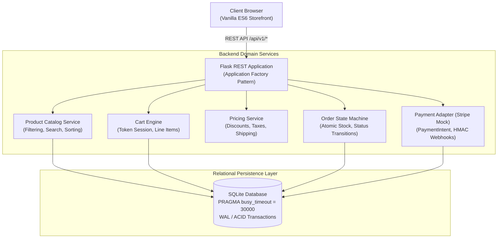
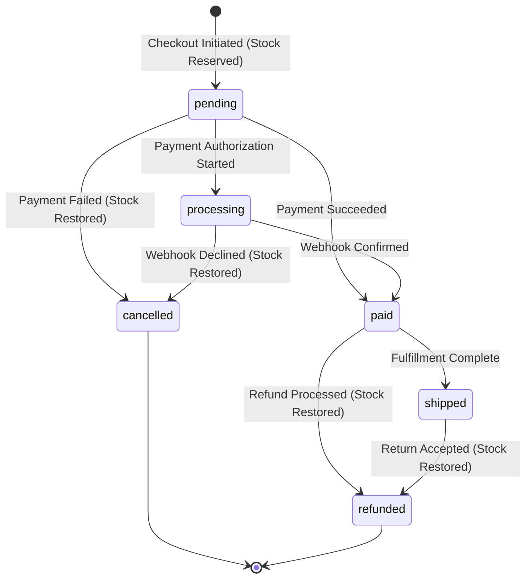

# 🛍️ Week 39: Production E-Commerce Platform v1 — ShopPulse

<div align="center">


<p align="center">
  <strong>A resilient, production-ready e-commerce platform featuring transactional cart state management, atomic stock reservation, Stripe payment gateway simulation, HMAC-verified webhook idempotency, an order state machine, automated invoicing, and a zero-dependency vanilla ES6 storefront.</strong>
</p>

</div>

---

## 📋 Table of Contents

- [Overview](#-overview)
- [System Architecture](#-system-architecture)
- [Key Features](#-key-features)
- [REST API Specification](#-rest-api-specification)
- [Order Lifecycle State Machine](#-order-lifecycle-state-machine)
- [Concurrency & Security Hardening](#-concurrency--security-hardening)
- [Quality Gates & Test Suite](#-quality-gates--test-suite)
- [Directory Structure](#-directory-structure)
- [Quickstart Guide](#-quickstart-guide)

---

## 🌟 Overview

Week 39 of **Project 52: Phase 3 (Production)** delivers **ShopPulse**, a transactional, production-grade e-commerce application designed to prevent real-world e-commerce failure modes: race conditions leading to overselling, webhook replay attacks, inconsistent cart pricing, and database lock exhaustion under concurrent traffic.

### Core Architectural Principles
1. **Atomic Stock Reservation**: Stock decrements occur inside database transactions conditioned on `stock_quantity >= quantity`. If inventory is insufficient, the transaction rolls back atomically.
2. **Pricing Single Source of Truth**: All totals, tiered discounts, tax calculations, and shipping thresholds are computed server-side by `PricingService`. The client cannot manipulate prices.
3. **Webhook Idempotency**: Stripe webhook events are recorded with unique IDs in `webhook_events`. Replayed or duplicate webhooks are detected and acknowledged without duplicate processing.
4. **Resilient Concurrency**: SQLite is configured with `timeout=30.0` and `PRAGMA busy_timeout = 30000`, preventing `OperationalError: database is locked` exceptions under concurrent worker loads.
5. **Zero-Dependency Frontend**: Vanilla ES6 components with modular architecture, accessible inline SVG icons, pure CSS design tokens, and zero external CDN requirements.

---

## 🏗️ System Architecture



---

## 📦 Key Features

### Backend Architecture
- **Catalog Management**: Paginated product queries, category slug filtering, full-text search, and multi-field sorting (`price_asc`, `price_desc`, `name_asc`, `newest`).
- **Session-Based Cart Engine**: Anonymous and registered carts tracked via secure `X-Cart-Token` header.
- **Dynamic Pricing Service**: Subtotal calculation in integer cents, tiered promo coupon codes (`DISCOUNT10`, `SAVE20`, `WELCOME5`), sales tax computation (8.25%), and free shipping threshold ($50.00).
- **Atomic Order Checkout**: Two-phase checkout initiating payment intent, holding inventory, and clearing active carts.
- **Payment Gateway Simulation**: Stripe-compatible adapter simulating `success`, `decline`, and `insufficient_funds` scenarios.
- **Automated Invoicing**: Printable invoice generator compiling line items, tax breakdowns, customer metadata, and transaction identifiers.

### Frontend Storefront
- **Responsive Catalog Grid**: Live category tabs, instant debounced search (250ms), and sort selectors.
- **Interactive Slide-Out Cart Drawer**: Quantity steppers with inventory limits, promo code input with removal action, and free shipping progress meter.
- **Checkout Modal**: Customer details form with integrated payment scenario simulator.
- **Order Success View**: Status-tagged receipt with itemized breakdown and 1-click invoice printing (`window.print()`).
- **SVG Icon Engine**: Zero-CDN inline SVG system with `currentColor` theming for optimal rendering performance.
- **Image Fallback System**: Category-specific placeholder artwork (`keyboard`, `headphones`, `accessories`, `apparel`) with automatic error recovery.

---

## 📡 REST API Specification

All endpoints are versioned under `/api/v1`. Monetary values are represented in integer cents to eliminate floating-point rounding errors.

### Catalog Endpoints
| Method | Endpoint | Description |
|:-------|:---------|:------------|
| `GET` | `/api/v1/health` | Service health status and database liveness |
| `GET` | `/api/v1/categories` | List product categories with product counts |
| `GET` | `/api/v1/products` | Query products (`category`, `search`, `sort`, `limit`, `offset`) |
| `GET` | `/api/v1/products/<slug>` | Retrieve single product details |

### Shopping Cart Endpoints
| Method | Endpoint | Description |
|:-------|:---------|:------------|
| `GET` | `/api/v1/cart` | Retrieve current cart items and pricing breakdown |
| `POST` | `/api/v1/cart/items` | Add product to cart (`{product_id, quantity}`) |
| `PATCH` | `/api/v1/cart/items/<id>` | Update item quantity in cart (`{quantity}`) |
| `DELETE` | `/api/v1/cart/items/<id>` | Remove item from cart |
| `DELETE` | `/api/v1/cart` | Empty all items from cart |
| `POST` | `/api/v1/cart/promo` | Apply promotional discount code (`{promo_code}`) |
| `DELETE` | `/api/v1/cart/promo` | Remove active promo discount code |

### Checkout & Order Endpoints
| Method | Endpoint | Description |
|:-------|:---------|:------------|
| `POST` | `/api/v1/checkout/create-order` | Create order with stock reservation |
| `POST` | `/api/v1/checkout/simulate-payment`| Simulate payment intent authorization |
| `GET` | `/api/v1/orders/<order_number>` | Retrieve order details by order number |
| `GET` | `/api/v1/orders/<order_number>/invoice` | Retrieve formatted order invoice |
| `POST` | `/api/v1/webhooks/stripe` | Ingest Stripe webhook events with HMAC verification |

---

## 🔄 Order Lifecycle State Machine

Orders enforce strict lifecycle transitions to guarantee state consistency:



---

## 🛡️ Concurrency & Security Hardening

| Protection | Implementation | Threat Mitigated |
|:-----------|:---------------|:-----------------|
| **Database Busy Timeout** | `PRAGMA busy_timeout = 30000;` on all connections | Eliminates `database is locked` under concurrent threads |
| **Atomic Inventory Decrement** | `UPDATE products SET stock = stock - ? WHERE id = ? AND stock >= ?` | Prevents race condition overselling under simultaneous checkouts |
| **XSS Sanitization** | `html.escape()` on all order customer input fields | Prevents script injection in stored orders and invoices |
| **Webhook Signature Verification** | Strict `Stripe-Signature` validation via `payment_service` | Rejects forged or unauthorized payment confirmation events |
| **Webhook Idempotency** | Unique `event_id` indexed column in `webhook_events` | Prevents double-processing of replayed webhook deliveries |
| **Promo Code Validation** | Length capping (`<= 30`), whitespace validation, alphanumeric check | Prevents ReDoS, buffer abuse, and SQL fuzzing |

---

## 🧪 Quality Gates & Test Suite

The test suite contains **52 automated unit and integration tests** providing **95.39% branch coverage**.

### Quality Gates Summary
```text
=================================================================
  SHOPPULSE E-COMMERCE: QUALITY GATES VERIFICATION
=================================================================
  * FLAKE8 LINTER      : [PASS] Strict 88-char limit, PEP 8 clean
  * BLACK FORMATTER    : [PASS] 100% compliant formatting
  * ISORT IMPORTS      : [PASS] Deterministic import ordering
  * BANDIT SECURITY    : [PASS] Zero security vulnerabilities
  * PYTEST COVERAGE    : [PASS] 52/52 passed, 95.39% coverage
=================================================================
Summary: 5/5 checks passed.
```

### Test Module Distribution
- `test_products.py` (11 tests): Catalog querying, filtering, search, sorting, stock checks.
- `test_cart.py` (13 tests): Cart tokens, item addition, quantity updates, promo codes, tax, shipping thresholds.
- `test_orders_and_webhooks.py` (11 tests): Order creation, stock deduction, state transitions, webhook idempotency, invoices.
- `test_concurrency_and_security.py` (6 tests): Concurrent 10-thread race conditions, SQL injection fuzzing, XSS sanitization, webhook forgery.
- `test_health_and_version.py` (4 tests): Health check routes, database connectivity verification.
- `test_coverage_boost.py` (7 tests): Edge cases, error handler coverage, configuration overrides.

---

## 📁 Directory Structure

```
week39_ecommerce_store/
├── backend/
│   ├── app/
│   │   ├── config/
│   │   │   ├── __init__.py
│   │   │   └── settings.py
│   │   ├── models/
│   │   │   ├── __init__.py
│   │   │   ├── cart_model.py
│   │   │   ├── order_model.py
│   │   │   ├── product_model.py
│   │   │   └── webhook_event_model.py
│   │   ├── routes/
│   │   │   ├── __init__.py
│   │   │   ├── cart_routes.py
│   │   │   ├── health_routes.py
│   │   │   ├── order_routes.py
│   │   │   ├── product_routes.py
│   │   │   └── webhook_routes.py
│   │   ├── services/
│   │   │   ├── __init__.py
│   │   │   ├── payment_service.py
│   │   │   └── pricing_service.py
│   │   ├── __init__.py
│   │   └── db.py
│   ├── data/
│   │   ├── schema.sql
│   │   └── seed.py
│   ├── scripts/
│   │   └── run_quality_checks.py
│   ├── tests/
│   │   ├── conftest.py
│   │   ├── test_cart.py
│   │   ├── test_concurrency_and_security.py
│   │   ├── test_coverage_boost.py
│   │   ├── test_health_and_version.py
│   │   ├── test_orders_and_webhooks.py
│   │   └── test_products.py
│   ├── requirements.txt
│   └── run.py
├── frontend/
│   ├── public/
│   │   └── index.html
│   └── src/
│       ├── api/
│       │   └── storeApi.js
│       ├── assets/
│       │   ├── base.css
│       │   └── store.css
│       ├── components/
│       │   ├── cartDrawer.js
│       │   ├── checkoutModal.js
│       │   ├── navbar.js
│       │   ├── orderSuccess.js
│       │   ├── productGrid.js
│       │   └── toast.js
│       ├── utils/
│       │   └── helpers.js
│       └── main.js
└── README.md
```

---

## 🚀 Quickstart Guide

### 1. Backend Setup
```bash
# Navigate to backend directory
cd week39_ecommerce_store/backend

# Create and activate virtual environment
python -m venv venv
source venv/bin/activate  # On Windows: venv\Scripts\activate

# Install dependencies
pip install -r requirements.txt

# Run automated quality checks
python scripts/run_quality_checks.py

# Start Flask development server
python run.py
# Server runs on http://127.0.0.1:5000
```

### 2. Frontend Launch
Serve `week39_ecommerce_store/frontend/public/index.html` using any local HTTP server (VS Code Live Server on port 5500, Python `http.server`, or Nginx):

```bash
# Using Python built-in static server
cd week39_ecommerce_store/frontend
python -m http.server 5500
# Open http://127.0.0.1:5500/public/index.html in browser
```

The frontend client automatically routes API requests to `http://127.0.0.1:5000/api/v1` when served from external ports.
